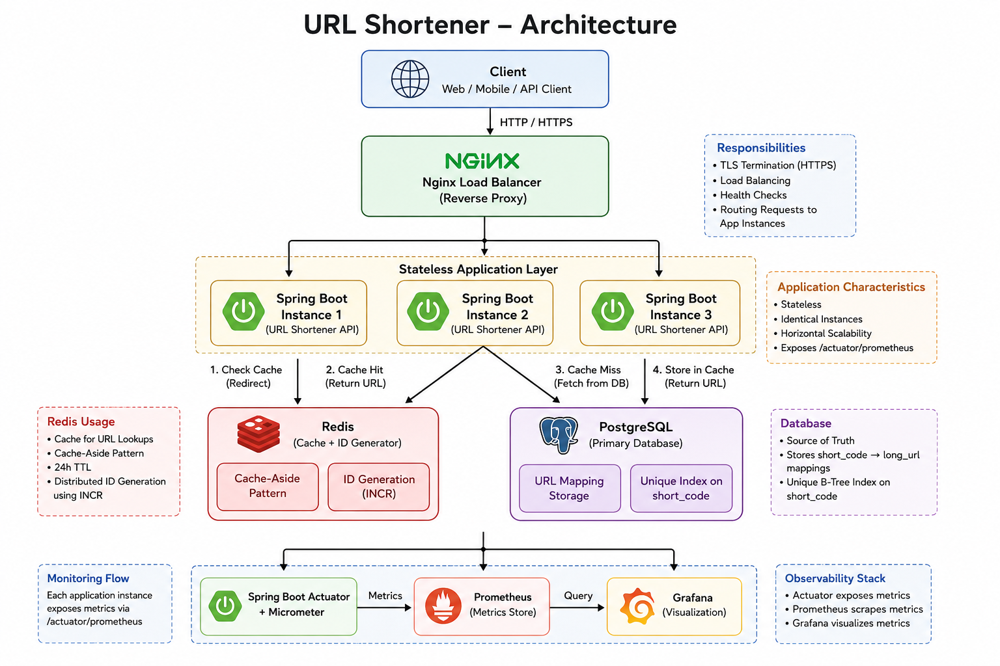

# URL Shortener

A production-inspired URL Shortener built with **Spring Boot**, **PostgreSQL**, **Redis**, **Docker**, and **Nginx** to learn backend engineering, distributed systems, scalability, observability, and performance testing.

---

# Features

## Core Functionality

* Generate short URLs
* Redirect to original URLs
* Base62 encoded short codes
* PostgreSQL persistence

---

## Caching

* Redis Cache-Aside pattern
* Redis-based distributed ID generation (`INCR`)
* Configurable cache TTL
* Custom cache hit/miss metrics

---

## Scalability

* Multiple Spring Boot application instances
* Nginx load balancing
* Stateless application architecture
* Shared Redis cache
* Shared PostgreSQL database

---

## Observability

* Spring Boot Actuator
* Micrometer metrics
* Prometheus monitoring
* Grafana dashboards

---

## Performance

* k6 load testing
* Create URL benchmark
* Redirect benchmark
* Mixed workload benchmark

---

## Infrastructure

* Docker
* Docker Compose
* PostgreSQL
* Redis
* Nginx

---

# Tech Stack

| Category            | Technology                                            |
| ------------------- | ----------------------------------------------------- |
| Language            | Java 26                                               |
| Framework           | Spring Boot 4                                         |
| Database            | PostgreSQL 17                                         |
| Cache               | Redis 8                                               |
| ORM                 | Spring Data JPA / Hibernate                           |
| Reverse Proxy       | Nginx                                                 |
| Monitoring          | Spring Boot Actuator, Micrometer, Prometheus, Grafana |
| Performance Testing | Grafana k6                                            |
| Containerization    | Docker, Docker Compose                                |

---

# Architecture



---

# Project Structure

```text
url-shortener/
│
├── docs/
├── monitoring/
├── nginx/
├── performance/
├── src/
├── Dockerfile
├── docker-compose.yml
└── pom.xml
```

---

# Quick Start

Clone the repository.

```bash
git clone <repository-url>
```

Start the complete environment.

```bash
docker compose up --build
```

The application will start with:

* PostgreSQL
* Redis
* Three Spring Boot instances
* Nginx
* Prometheus
* Grafana

---

# Performance Summary

| Scenario       |    Throughput | P95 Latency |
| -------------- | ------------: | ----------: |
| Create URL     |  ~2,600 req/s |       ~7 ms |
| Redirect       |  ~9,600 req/s |     ~8.8 ms |
| Mixed Workload | ~10,000 req/s |     ~9.1 ms |

Benchmarks were executed using **Grafana k6**.

---

# Documentation

Detailed engineering documentation is available in the `docs/` directory.

Topics include:

* Requirements
* Capacity Estimation
* API Design
* High-Level Design
* Low-Level Design
* Database Design
* Redis Caching
* Load Balancing
* Performance Testing
* Observability
* Scaling Strategies
* Design Trade-offs
* Future Improvements
* Interview Questions

---

# Project Evolution

| Version | Highlights                                                  |
| ------- | ----------------------------------------------------------- |
| V1      | Basic URL shortening service with PostgreSQL                |
| V2      | Base62 encoding                                             |
| V3      | Redis caching and distributed ID generation                 |
| V4      | Dockerized application                                      |
| V5      | Docker Compose, multiple application instances, Nginx       |
| V6      | Performance testing, Prometheus, Grafana                    |
| V7      | Cache metrics, database indexing, engineering documentation |

---

# Learning Objectives

This project was built to gain hands-on experience with:

* REST API Design
* Layered Architecture
* Database Design
* Redis Caching
* Distributed ID Generation
* Load Balancing
* Horizontal Scaling
* Performance Testing
* Application Observability
* Docker-Based Deployment
* Backend System Design

---

# Future Enhancements

Planned improvements include:

* Custom short URLs
* URL expiration
* Click analytics
* Rate limiting
* PostgreSQL read replicas
* Redis Cluster
* High availability
* Kubernetes deployment

---

# License

This project is intended for learning and educational purposes.
